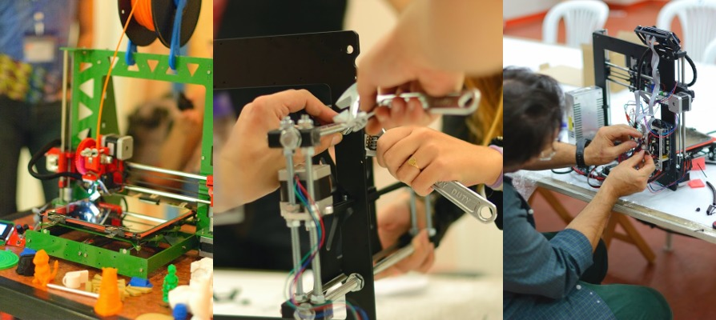

**HackLab Almería** es un colectivo de **experimentación tecnológica**,
**social** y **creativa**. Pretende mantener un modelo de organización flexible,
pragmático y distribuido geográficamente por toda la provincia de Almería. Si
bien procuramos huir de prejuicios sí reconocemos predilección por las
tendencias y modelos de trabajo abiertos en tecnología, ciencia y cultura
contemporáneos que están revolucionando la sociedad en el último decenio y
medio. Ven y crea tus propias oportunidades.

##Próximos Eventos

{% assign curDate = site.time | date: '%s' %}
<ul>

    {% assign date = post.date | date: '%s' %}
    
        <li>{{ post.date | date_to_string }} &raquo; <a href="{{ post.url }}">{{ post.title }}</a></li>
    

</ul>

